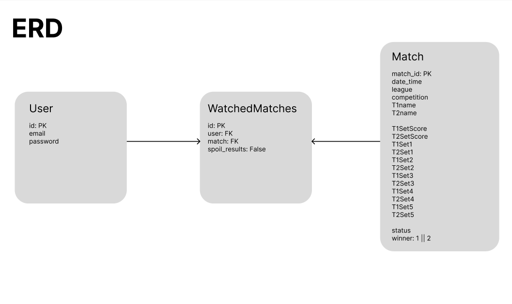

# No Spoilers - Server Repo
View a schedule of tennis matches and only spoil the results when you want to! 

- [Deployed App](https://no-spoilers-tennis-client.onrender.com/)
- [Front End Repo](https://github.com/dwindleduck/no-spoilers-tennis-client)

## How was I stretching myself with this project:
- Python/Django backend paired with Javascript/React frontend
- Consumed data from a 3rd party API

## Improvements made since initial project build and presentation:
- Set up development and production environments
- Set up demo login button
- Migrated datatbase after original provider sunset their service
- Simplified backend routes
- Clarified front end state management and data deliverly
- Resolved timezone issues
- Loading functionality: spinner animation, disabled buttons
- Added note "matches for this day last updated at: "
- Updated the 3rd party API call schedule

## Technologies Used
### Backend
- Python
- Django
- 3rd party API - [LiveScore by Api Dojo](https://rapidapi.com/apidojo/api/livescore6)
- PostgreSQL

### Frontend
- React
- Javascript
- CSS
- HTML

## ERD

## Routes Table
| NAME    |         PATH                               | HTTP VERB |        PURPOSE              |
| :---    |    :----                                   |   :---:   |        :----                |
| Sign Up | sign-up/                                   | POST      | Register new account        |
| Sign In | sign-in/                                   | POST      | Sign in user                |
| Sign Out| sign-out/                                  | DELETE    | Sign out user               |
| Index   | watched_matches/create_and_get/<str:date>/ | GET       | Get match info by date      |
| Update  | watched_matches/<int:pk>/                  | PATCH     | Update a watch card         |

## User Stories
### MVP
- AAU, I would like to be able to sign up, sign in, and sign out
- AAU, I would like to see a list of matches by date, then by tournament
- AAU, I would like to be able to spoil/hide results of each match

### ICE BOX
- AAU, I would like to filter a list of matches by tournament or league
- AAU, I would like to see a bracket layout for a tournament
- AAU, I only want to spoil the details of an upcoming match if the two previous matches have been spoiled
- AAU, I would like to spoil all matches on the current page or for a selected tournament
- AAU, I would like to favorite specific matches
- AAU, I would like to see a list of my favorited matches

## Wireframes

## Deployment Screenshots

